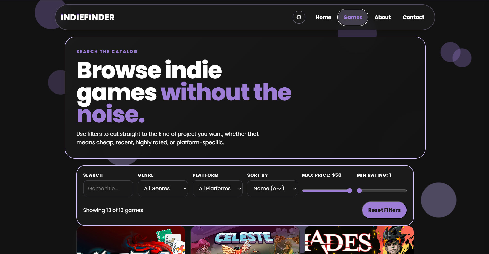
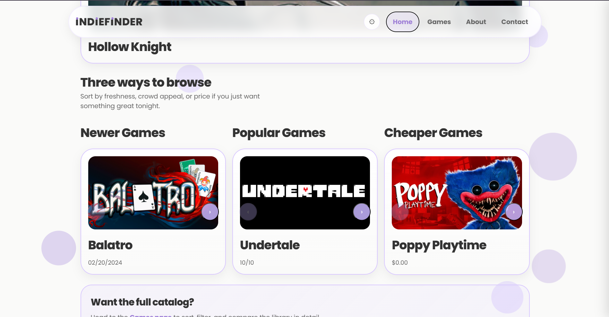
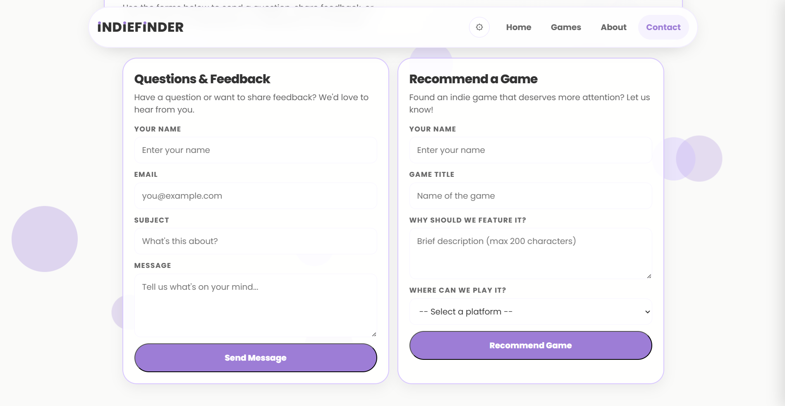

# IndieFinder

IndieFinder is a site built around one idea: indie games deserve to be found. Bigger releases tend to drown out smaller studios, so this app gives those games a dedicated space where people can browse, discover, and recommend titles they love.

It's a full-stack CRUD app — a React frontend, an Express backend, and a live PostgreSQL database hosted on Neon. Users can browse the game catalog, filter by genre and platform, send a contact message, or submit a game recommendation that gets saved to the database.

**Live site:** https://project-4-indiefinder-backend.vercel.app  
**API:** https://indiefinder-api.onrender.com  
**GitHub:** https://github.com/Braedan-Mitchell/project-4-indiefinder.backend

---

## Tech Stack

| Layer | Technology |
|---|---|
| Frontend | React 18, React Router v6, Vite |
| Backend | Node.js, Express 5 |
| Database | PostgreSQL (Neon cloud) |
| Frontend deploy | Vercel |
| Backend deploy | Render |

---
</>

## Screenshots

### Home Page


### Game Search and Filters


### Recommendations


---

## Features

- Browse 13 curated indie games with filtering by genre, platform, and price
- Expandable game cards with full details
- Home page carousels: Featured, Newest, Most Popular, Cheapest
- Contact form — submissions are saved to the database
- Game recommendation form — submitted games show up in a live review log on the page

---

## User Stories

1. As a bored gamer, I want to easily find a fresh new indie game to give a try.
2. As someone who saw a game while scrolling YouTube, I want to see if I have the hardware to get it.
3. As a fan of a specific indie game, I want to be able to send them extra money to show my appreciation.

---

## Running It Locally

You'll need Node.js 18+ and a Neon PostgreSQL database set up before starting.

### 1. Clone the repo
```bash
git clone https://github.com/Braedan-Mitchell/project-4-indiefinder.backend.git
cd project-4-indiefinder.backend
```

### 2. Install dependencies
```bash
cd server
npm install
```

### 3. Create the `.env` file
Inside `server/`, create a file named `.env` and add your Neon connection string:
```
DATABASE_URL=your_neon_connection_string_here
PORT=3001
```

### 4. Set up the database
Run these in your Neon SQL editor to create the three tables the app needs:
```sql
CREATE TABLE games (
  id SERIAL PRIMARY KEY,
  image TEXT,
  title TEXT NOT NULL,
  price TEXT,
  genre TEXT,
  date TEXT,
  console TEXT[],
  rating TEXT
);

CREATE TABLE recommendations (
  id SERIAL PRIMARY KEY,
  recommender_name TEXT NOT NULL,
  game_title TEXT NOT NULL,
  game_desc TEXT,
  found_on TEXT
);

CREATE TABLE contacts (
  id SERIAL PRIMARY KEY,
  name TEXT NOT NULL,
  email TEXT NOT NULL,
  title TEXT NOT NULL,
  message TEXT NOT NULL,
  created_at TIMESTAMPTZ DEFAULT NOW()
);
```

### 5. Start the app

You'll need two terminals running at the same time.

Backend (first terminal):
```bash
cd server
node index.js
```

Frontend (second terminal):
```bash
cd server
npm run dev
```

Then open `http://localhost:5173` in your browser. You should see the home page load with games from the database.

---

## API Endpoints

| Method | Route | Description |
|---|---|---|
| GET | `/games` | Get all games |
| GET | `/games/:id` | Get a single game |
| POST | `/games` | Create a game |
| PUT | `/games/:id` | Update a game |
| DELETE | `/games/:id` | Delete a game |
| GET | `/recommendations` | Get all recommendations |
| POST | `/recommendations` | Submit a recommendation |
| GET | `/contacts` | Get all contact submissions |
| POST | `/contacts` | Submit a contact message |

---

## Project Structure

```
project-4-indiefinder.backend/
├── client/          # React frontend source
│   └── src/
│       ├── components/
│       ├── pages/
│       ├── context/
│       ├── services/   # API client
│       └── utils/
└── server/          # Express backend + Vite config
    ├── index.js
    ├── vite.config.js
    └── src/
        ├── controllers/
        ├── routes/
        ├── services/
        └── db/
```

---

## Wireframe

https://www.figma.com/make/Y1tC8fRCJvtRQDHPoC4WwG/Indie-Game-Discovery-Website?fullscreen=1&t=ohY3U6OvHvDX5Zwh-1
